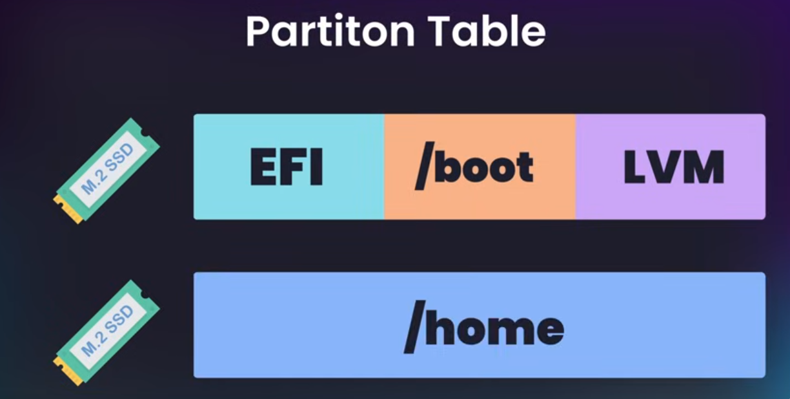

# Installing Arch Linux

Official guide<br/>
<a href="https://wiki.archlinux.org/title/Installation_guide">Installation Guide</a><br/>

## First Tutorial
Youtube link
<br/>
<a href="https://www.youtube.com/watch?v=FxeriGuJKTM" target="_blank">Video link</a>
<br/>
<a href="https://www.learnlinux.tv/how-to-install-arch-linux-a-comprehensive-step-by-step-guide/" target="_blank">Blog Post</a>

We are gonna use LVM and encryption.<br/>
One thing that is mentioned is to <b>disable secure boot</b> for the process of installation, you can enable it afterwards.

### wifi connection
First check your ip and get the name of your interface for example
    <b>wlan0</b>: 
```
ip addr show 
```

run the ```iwctl``` command<br/> 
check for networks
``` 
 [iwd]# station wlan0 get-networks 
 [iwd]# exit
```

Exit the iwd shell and run this and replace your password and SSID:
``` 
root@archiso : iwctl --passphrase "YOUR_PASSWORD" station wlan0 connect "SSID"
```

### Partitioning the disk
```
lsblk
```

Choose your disk for example an nvme drive like this
```
fdisk /dev/nvme0n1
```

type <b>"p" + Enter</b> to get the current partition layout<br/>
type <b>"g" + Enter</b> to get an empty partition table<br/>
type "p" again to check things out<br/>
press <b>"n"</b> to create a new partition.<br/>
for the first two accept the default<br/>

```
Partition Number (1-128, default 1) : 
First Sector (): 
Last sector : +1G
```

Choose +1G for a 1GB partition.<br/>
If you had a linux system you get a warning.<br/>
Confirm and Press <b>"Y"</b> <br/>

create the second partition:<br/>
press "n" Again accept the first two and for the last one again choose +1G<br/>

create the 3rd and last partition choose the all the defaults to<br/>
choose the entirety of the rest of the hard drive.<br/>
Later we are gonna use LVM for this.<br/>

now press <b>"t"</b> which means type and we select the partition number 3<br/>
and we choose <b>"44"</b> for "Linux lvm"<br/>
You can type <b>"L"</b> to get all the partition types.<br/>

double check with "p" and enter and then finalize<br/>
by typing <b>"w"</b> and enter to write the changes.<br/>

### Formating partitions
```
mkfs.fat -F32 /dev/nvme0n1p1
```

```
mkfs.ext4 /dev/nvme0n1p2
```

Now we set up the third partition but not format it just yet<br/>
We are gonna encrypt this partition because it is where all of our data<br/>
is stored <br/>

```
cryptsetup luksFormat /dev/nvme0n1p3
```
Confirm and set a password<br/>

Now we decrypt that partition to setup <u>lvm</u> on it<br/>
the name "lvm" is just for referring to this volume<br/>
```
cryptsetup open --type luks /dev/nvme0n1p3 lvm
```

### LVM Setup
this is where we use the name that we defined in decrypring the partition , the "lvm" <br/>
```
pvcreate /dev/mapper/lvm
vgcreate volgroup0 /dev/mapper/lvm
lvcreate -L 30GB volgroup0 -n lv_root
lvcreate -L 250GB volgroup0 -n lv_home
```
Note that in here we chose to not to use the entire hard drive<br/>
If we wanted to choose the entire remaining free space<br/>
```
lvcreate -l +100%FREE volgroup0 -n lv_home
```

To verify things and see the volume group<br/>
```
vgdisplay
```

To see the logical volumes<br/>
```
lvdisplay
```

Insert the required kernel modules<br/>
``` 
modprobe dm_mod 
```

scan for available volume groups<br/>
```
vgscan
```

Activate all volume groups<br/>
```
vgchange -ay
```

### Format and mount the partitions

```
mkfs.ext4 /dev/volgroup0/lv_root
mkfs.ext4 /dev/volgroup0/lv_home
```

mount root partition<br/>
```
mount /dev/volgroup0/lv_root /mnt
```

mount /home but first create a directory<br/>
```
mkdir /mnt/home
mount /dev/volgroup0/lv_home /mnt/home
```

 make the boot directory<br/>
```
mkdir /mnt/boot
mount /dev/nvme0n1p2 /mnt/boot
```

### Install <b>base</b>
```
pacstrap -i /mnt base
```

### generate the <b>fstab</b> file
```
genfstab -U -p /mnt >> /mnt/etc/fstab
```

### chroot into installation
```
arch-chroot /mnt
```

Now we are inside the installation<br/>
set root password<br/>

```
passwd
```

Create a new user<br/>

```
useradd -m -g users -G wheel reza
```

Set password for user<br/>

```
passwd reza
```

### Install basic packages
```
pacman -S base-devel dosfstools grub efibootmgr gnome gnome-tweaks lvm2 mtools nano networkmanager openssh os-prober sudo
```
<div>
side note<br/>
These are the absolute necessary ones:<br/>
    <ul>
      <li>base</li>
      <li>lvm2</li>
      <li>linux</li>
      <li>linux-firmware</li>
      <li>base-devel</li>
      <li>neovim</li>
      <li>grub</li>
      <li>efibootmgr</li>
      <li>networkmanager</li>
    </ul>
</div>


### Install at least one kernel
```
pacman -S linux linux-headers linux-lts linux-lts-headers
```

### Install firmware files
```
pacman -S linux-firmware
```
here we install a second kernel as a backup in case our kernel <br/>
have a problem in future so we are <br/>
installing <b>linux-lts linux-lts-headers</b>

### Inspect GPU

The following command will list PCI devices on your system, which may help<br/>
if you’re not sure what kind of GPU you have. The output may offer clues.<br/>
```
lspci
```

If you have an Intel or AMD GPU, install mesa:<br/>
```
pacman -S mesa
```

If you have an Nvidia GPU:<br/>
```
pacman -S nvidia nvidia-utils
```

If you have an Nvidia GPU and you installed the LTS kernel earlier:<br/>
```
pacman -S nvidia-lts
```

If you need support for accelerated video decoding, consider installing these packages.<br/>
```
Intel (Broadwell and newer): intel-media-driver
Intel GMA 4500 up to Coffee Lake: libva-mesa-driver
AMD: libva-mesa-driver
Nvidia: Already taken care of with nvida-utils, which was installed earlier
```

### Generating Ram Disk(s) for our Kernel(s)
```
nvim /etc/mkinitcpio.conf
```

add <b> encrypt lvm2 </b> in hooks line <br/>
```
Add encrypt lvm2 in between block and filesystems
```

looks like this<br/>
```
HOOKS=(... block encrypt lvm2 filesystems fsck )
```


### Generate kernel ramdisks

If you installed the linux package:<br/>
```
mkinitcpio -p linux
```

If you <b>also</b> installed the linux-lts package:<br/>
```
mkinitcpio -p linux-lts
```


### set the local information
Edit <b>/etc/locale.gen</b> and uncomment <i>en_US.UTF-8</i>:<br/>
```
nvim /etc/locale.genlocale-gen
```

Generate the local<br/>
```
locale-gen
```


### Set up GRUB
Edit the <b>/etc/default/grub</b> file.<br/>
```
nvim /etc/default/grub
```

Within that file, look for a line <br/>
containing <b>GRUB_CMDLINE_LINUX_DEFAULT</b> and <br/>
add <br/>
<b>cryptdevice=/dev/<device-name>:<volume-group></b> <br/>
to the end of it. For example, a <br/>
typical configuration line of this type might look like this:<br/>

```
GRUB_CMDLINE_LINUX_DEFAULT="loglevel=3 quiet root=/dev/mapper/arch-root cryptdevice=UUID=<uuid>:luks_lvm"
```
use this<br/>
```
blkid
```

or in my case<br/>
```
blkid /dev/nvme0n1p3
```

<b>The reason to get the UUID is in case of a CMOS reset, everything stays the same.</b><br/>
so use the UUID in the /etc/default/grub file  <br/>

```
cryptdevice=/dev/nvme0n1p3:volgroup0
```

Next, create the <b>/boot/EFI</b> directory and 
mount our first partition to it:<br/>
```
mkdir /boot/EFI
```

```
mount /dev/nvme0n1p1 /boot/EFI
```

Now we can install GRUB:<br/>

```
grub-install --target=x86_64-efi --bootloader-id=grub_uefi --recheck
```

The next command will copy locale files for GRUB’s messaging to our boot directory:<br/>

```
cp /usr/share/locale/en\@quot/LC_MESSAGES/grub.mo /boot/grub/locale/en.mo
```

Generate a config file for GRUB:<br/>

```
grub-mkconfig -o /boot/grub/grub.cfg
```

Enable GDM to start when you reboot:<br/>
```
systemctl enable gdm
```

Enable NetworkManager so networking will function when you reboot:<br/>
```
systemctl enable NetworkManager
```

Exit our chroot environment:<br/>
```
exit
```

Unmount all partitions:<br/>
```
umount -a
```

Reboot the system:<br/>
```
reboot
```


in gnome make sure you choose the language and locale<br/>
in <b>Region & Language</b>  or some apps wont even start<br/>

********************************************************************************

## Second Tutorial
Youtube link
<br/>
<a href="https://www.youtube.com/watch?v=YC7NMbl4goo" target="_blank">Video link</a>
<br/>

### Download
first select a mirror and download the arch iso from any mirror you want from here<br/>
<a href="https://archlinux.org/download/">Download iso file page</a><br/>
also download the `b2sums.txt` and `sha256sums.txt` file.<br/>
we can use either of these 2 commands to verify the hashsum of the image:
```
b2sum -c b2sums.txt
```
or
```
sha256sum -c sha256sums.txt
```
You can also run the commands with the `--ignore-missing` flag like this:
```
b2sum -c b2sums.txt --ignore-missing
```
or
```
sha256sum -c sha256sums.txt --ignore-missing
```

If you get the **OK**, you are good to go<br/>

For the next part we need `GnuPG` :
First run this:
```
gpg --auto-key-locate clear,wkd -v --locate-external-key pierre@archlinux.org
```
With this command we download the public key to verify the signature. 

Now we verify the signature:
```
gpg --keyserver-options auto-key-retrieve --verify archlinux-2024.12.01-x86_64.iso.sig archlinux-2024.12.01-x86_64.iso
```
make sure that your `.iso` file and `.sig` file are correct .
All these command are available in the download page for verifying the hash sum and the signature.

### Flash to a USB drive
we can use the `dd` command for example:
```
sudo dd if=./archlinux-2024.12.01-x86_64.iso of=/dev/disk5 bs=4M status=progress
```
make sure to use the `lsblk` commad and identify the correct drive, otherwise you could mess things up .
For example I ran this:
```
sudo dd if=./archlinux-2024.12.01-x86_64.iso of=/dev/sda bs=4M status=progress
```
Since my USB drive was /dev/sda .<br/>

This command is the official way:
```
sudo dd bs=4M if=archlinux-2024.12.01-x86_64.iso of=/dev/sda conv=fsync oflag=direct status=progress
```

Or you can use `balena etcher` which is available on `AUR`:
```
yay -S balena-etcher
```
And use this tool to burn your iso.

All the info on USB `flash installation medium` is available here
<a href="https://wiki.archlinux.org/title/USB_flash_installation_medium">Link</a>

**Note** If you have any problem with your USB drive which I had! all I did I used fdisk or gdisk and created a new
partition table with `g` for `gpt` and then used the official `dd` command with correct flags.

### WiFi

Enter iwctl

```
$ iwctl
```

When inside, check for the name of your wireless devices.

```
device list
```

If your device name is `wlan0`, connect using the following command

```
station wlan0 connect <SSID>
```

Make sure to enter in your password

exit when complete

```
exit
```

### SSH

Enable sshd (should be done by default)

```
$ systemctl enable sshd
```

set a password for the current user

```
$ passwd
```

### Write random data

List blocks. In my case, my drives are nvme0n1 and nvme1n1. Your's might be the
same, or the might be an sdx drive, such as sda or sdb.

```
$ lsblk
```

Write random data into your drive. 

```
$ dd if=/dev/urandom of=/dev/nvme0n1 status=progress bs=4096
```
if you have a second drive , for example nvme1n1, you could do the same. Note that it takes a long time.

### Partitioning Data
Note that in this example we have 2 drives:

<br/>
    EFI : Contains our linux image<br/>
    /boot : Contains our bootloader<br/>
    LVM : Conatining multiple volumes<br/>


Get the names of the blocks

```
$ lsblk
```

For both partition setups, you'll want to setup a table on your primary drive.

```
$ gdisk /dev/nvme0n1
```

Inside of gdisk, you can print the table using the `p` command. You can also type `L` and search for a term for example
the `efi` and get the correct code.

To create a new partition use the `n` command. The below table shows 
the disk setup I have for my primary drive

| partition | first sector | last sector | code |
|-----------|--------------|-------------|------|
| 1         | default      | +512M       | ef00 |
| 2         | default      | +4G         | ef02 |
| 3         | default      | default     | 8309 |

If you have a second drive for your home disk, then your table would be as 
follows.

| partition | first sector | last sector | code |
|-----------|--------------|-------------|------|
| 1         | default      | default     | 8302 |

### Encryption

Load the encryption modules to be safe.

```
$ modprobe dm-crypt
$ modprobe dm-mod
```

Setting up encryption on our luks lvm partiton

```
$ cryptsetup luksFormat -v -s 512 -h sha512 /dev/nvme0n1p3
```

Enter in your password and **Keep it safe**. There is no "forgot password" here.


If you have a home partition, then initialize this as well

```
$ cryptsetup luksFormat -v -s 512 -h sha512 /dev/nvme1n1p1
```

Mount the drives:

```
$ cryptsetup open /dev/nvme0n1p3 luks_lvm
```

If you have a home parition:

```
$ cryptsetup open /dev/nvme1n1p1 arch-home
```

### Volume setup

Create the volume and volume group

```
$ pvcreate /dev/mapper/luks_lvm

$ vgcreate arch /dev/mapper/luks_lvm
```

Create a volume for your swap space. A good size for this is your RAM size + 2GB.
In my case, 64GB of RAM + 2GB = 66G.

```
$ lvcreate -n swap -L 66G arch
```

Next you have a few options depending on your setup

#### Single Disk
If you have a single disk, you can either have a single volume for your root 
and home, or two separate volumes.

##### Single volume 

Single volume is the most straightforward. To do this, just use the entire
disk space for your root volume

```
$ lvcreate -n root -l +100%FREE arch
```

##### Two volumes

For two volumes, you'll need to estimate the max size you want for either your
root or home volumes. With a root volume of 200G, this looks like:

```
$ lvcreate -n root -L 200G arch
```

Then use remaining disk space for home

```
$ lvcreate -n home -l +100%FREE arch
```

#### Dual Disk

If you have two disks, then create a single volume on your LVM disk.

```
$ lvcreate -n root -l +100%FREE arch
```


### Filesystems

FAT32 on EFI partiton

```
$ mkfs.fat -F32 /dev/nvme0n1p1 
```

EXT4 on Boot partiton

```
$ mkfs.ext4 /dev/nvme0n1p2
```

BTRFS on root

```
$ mkfs.btrfs -L root /dev/mapper/arch-root
```

BTRFS on home if exists

```
$ mkfs.btrfs -L home /dev/mapper/arch-home
```

Setup swap device

```
$ mkswap /dev/mapper/arch-swap
```

### Mounting

Mount swap

```
$ swapon /dev/mapper/arch-swap
$ swapon -a
```

Mount root 

```
$ mount /dev/mapper/arch-root /mnt
```

Create home and boot

```
$ mkdir -p /mnt/{home,boot}
```

Mount the boot partiton

```
$ mount /dev/nvme0n1p2 /mnt/boot
```

Mount the home partition if you have one, otherwise skip this

```
$ mount /dev/mapper/arch-home /mnt/home
```

Create the efi directory

```
$ mkdir /mnt/boot/efi
```

Mount the EFI directory

```
$ mount /dev/nvme0n1p1 /mnt/boot/efi
```

### Install arch

```
$ pacstrap -K /mnt base linux linux-firmware
```

With base-devel

```
$ pacstrap -K /mnt base base-devel linux linux-firmware
```

Load the file table

```
$ genfstab -U -p /mnt > /mnt/etc/fstab
```

chroot into your installation

```
$ arch-chroot /mnt /bin/bash
```

### Configuring

#### Text Editor

Install a text editor

```
$ pacman -S neovim
```

```
$ pacman -S nano
```

#### Decrypting volumes

Open up mkinitcpio.conf

```
$ nvim /etc/mkinitcpio.conf
```

add `encrypt` and `lvm2` into the hooks

```
HOOKS=(... block encrypt lvm2 filesystems fsck)
```

install lvm2

```
$ pacman -S lvm2
```

#### Bootloader

Install grub and efibootmgr

```
$ pacman -S grub efibootmgr
```

Setup grub on efi partition

```
$ grub-install --efi-directory=/boot/efi
```

obtain your lvm partition device UUID

```
blkid /dev/nvme0n1p3
```

Copy this to your clipboard

```
$ nvim /etc/default/grub
```

Add in the following kernel parameters

```
root=/dev/mapper/arch-root cryptdevice=UUID=<uuid>:luks_lvm
```

```
GRUB_CMDLINE_LINUX_DEFAULT="loglevel=3 quiet root=/dev/mapper/arch-root cryptdevice=UUID=<uuid>:luks_lvm"
```
```
blkid
```

or in my case<br/>
```
blkid /dev/nvme0n1p3
```

The reason to get the UUID is in case of a CMOS reset, everything stays the same.<br/>

#### Keyfile
This part is for making sure to enter the encryption password once.
we use a keyfile for each of our encrypted partitions.

```
$ mkdir /secure
```

Root keyfile
```
$ dd if=/dev/random of=/secure/root_keyfile.bin bs=512 count=8
```

Home keyfile if home partition exists

```
$ dd if=/dev/random of=/secure/home_keyfile.bin bs=512 count=8
```

Change permissions on these

```
$ chmod 000 /secure/*
```

Add to partitions

```
$ cryptsetup luksAddKey /dev/nvme0n1p3 /secure/root_keyfile.bin
# skip below if using single disk
$ cryptsetup luksAddKey /dev/nvme1n1p1 /secure/home_keyfile.bin
```

```
$ nvim /etc/mkinitcpio.conf
```


Add this in FILES line:
```
FILES=(/secure/root_keyfile.bin)
```

#### Home Partition Crypttab (Skip if single disk)

Get uuid of home partition

```
$ blkid /dev/nvme1n1p1
```

Open up the crypt table.
```
$ nvim /etc/crypttab
```

Add in the following line at the bottom of the table
```
arch-home      UUID=<uuid>    /secure/home_keyfile.bin
```

Reload linux

```
$ mkinitcpio -p linux
```

### Grub

Create grub config

```
$ grub-mkconfig -o /boot/grub/grub.cfg
$ grub-mkconfig -o /boot/efi/EFI/arch/grub.cfg
```

### System Configuration

#### Timezone

```
ln -sf /usr/share/zoneinfo/America/Chicago /etc/localtime
```

#### NTP

```
$ nvim /etc/systemd/timesyncd.conf
```

Add in the NTP servers

```
[Time]
NTP=0.arch.pool.ntp.org 1.arch.pool.ntp.org 2.arch.pool.ntp.org 3.arch.pool.ntp.org 
FallbackNTP=0.pool.ntp.org 1.pool.ntp.org
```

Enable timesyncd

```
# systemctl enable systemd-timesyncd.service
```

#### Locale

```
$ nvim /etc/locale.gen
```

uncomment the UTF8 lang you want

```
en_US.UTF-8 UTF-8
```

```
$ locale-gen
```

```
$ nvim /etc/locale.conf
```

```
LANG=en_US.UTF-8
```


#### hostname

enter it into your /etc/hostname file

```
$ nvim /etc/hostname
```

or 

```
$ echo "mymachine" > /etc/hostname
```

#### Users

First secure the root user by setting a password

```
$ passwd
```

Then install the shell you want

```
$ pacman -S zsh
```

Add a new user as follows

```
$ useradd -m -G wheel -s /bin/zsh user
```

set the password on the user

```
$ passwd user
```

Add the wheel group to sudoers

```
$ EDITOR=nvim visudo
```

```
%wheel ALL=(ALL:ALL) ALL
```

#### Network Connectivity

```
$ pacman -S networkmanager
$ systemctl enable NetworkManager
```

#### Display Manager

```
$ pacman -S gnome
```

```
$ systemctl enable gdm
```


#### Microcode

For AMD

```
$ pacman -S amd-ucode
```

For intel

```
$ pacman -S intel-ucode
```

```
$ grub-mkconfig -o /boot/grub/grub.cfg
$ grub-mkconfig -o /boot/efi/EFI/arch/grub.cfg
```


### Reboot

```
$ exit
$ umount -R /mnt
$ reboot now
```


********************************************************************************
## Third Tutorial
This is a simple guide without LVM and LUKS.<br/>
<a href="https://www.youtube.com/watch?v=68z11VAYMS8">Youtube Link</a><br/>

After booting you can set these:
### Set the console keyboard layout and font

The default console keymap is `US`. Available layouts can be listed with:
```
localectl list-keymaps
```

To set the keyboard layout, pass its name to loadkeys(1). For example, to set a German keyboard layout:
```
loadkeys de-latin1
```

I am using the US so
```
loadkeys us
```

Console fonts are located in `/usr/share/kbd/consolefonts/` and can likewise be set with setfont(8) omitting the path and file extension. For example, to use one of the largest fonts suitable for HiDPI screens, run:
```
setfont ter-132b
```
### Partitioning
This guide suggests using `cfdisk` instead of *fdisk* or *gdisk* , to make it a liitle more simple:
cfdisk is part of `core/util-linux` and more info can be found here
<a href="https://man.archlinux.org/man/cfdisk.8">Link</a>

**Note** You have to have root privileges to use `cfdisk` and also other tools like `fdisk` and `gdisk` which you have
in the installation shell, but if for some reason you want to mess around with these tools after installation, use
`sudo` .

Use `gpt` since you are on `UEFI` and then start the partitioning.<br/>


As for the scheme of partitioning same as before like this:<br/>
**boot** --- 1GB<br/>
**swap** --- 4GB<br/>
**root** --- rest of the disk<br/>

Format the partitions same as previous examples in the First and second Tutorial:<br/>
System root:
```
mkfs.ext4 /dev/sda3
```
boot:
```
mkfs.fat -F32 /dev/sda1
```
swap:
```
mkswap /dev/sda2
```

### mount partitions
```
mount /dev/sda3 /mnt
mkdir -p /mnt/boot/efi
mount /dev/sda1 /mnt/boot/efi
swapon /dev/sda2
```
Use `lsblk` to check things out<br/>

### Install essential packages
```
pacstrap -K /mnt base linux linux-firmware
```

### Fstab
Generate an fstab file (use -U or -L to define by UUID or labels, respectively):
```
genfstab -U /mnt >> /mnt/etc/fstab
```

Check the resulting /mnt/etc/fstab file, and edit it in case of errors.

### Chroot
Change root into the new system:
```
arch-chroot /mnt
```

### Time
Set the time zone:
```
ln -sf /usr/share/zoneinfo/<Region/City> /etc/localtime
```
change your zone info accordingly. For example it is something like this for me:
```
ln -sf /usr/share/zoneinfo/Iran /etc/localtime
```
or even better it is this
```
ln -sf /usr/share/zoneinfo/Asia/Tehran /etc/localtime
```

Use `ls` to view the content of `/usr/share/zoneinfo`<br/>

Check if time is correct:
```
date
```

### Localization
Edit `/etc/locale.gen` and uncomment `en_US.UTF-8 UTF-8` and other needed UTF-8 locales. Generate the locales by running:
```
locale-gen
```

Create the locale.conf(5) file, and set the LANG variable accordingly:
```
/etc/locale.conf

LANG=en_US.UTF-8
```

If you set the console keyboard layout, make the changes persistent in vconsole.conf(5):
```
/etc/vconsole.conf

KEYMAP=us
```

### Create the hostname file:
```
/etc/hostname

<yourhostname>
```

### Initramfs
Creating a new initramfs is usually not required, because mkinitcpio was run on installation of the kernel package with pacstrap.
For LVM, system encryption or RAID, modify mkinitcpio.conf(5) and recreate the initramfs image:
```
mkinitcpio -P
```

### Root password
Set the root password:
```
passwd
```

### Create a new user
```
useradd -m -G wheel -s /bin/zsh reza
```
Add your name at the end instead of mine.<br/>


set the password for the nwely created user
```
passwd reza
```


```
EDITOR=nvim visudo
```
Find this line and uncomment it
```
%wheel ALL=(ALL:ALL) ALL
```

### Enable core services
In this case we are jsut gonna enable network manager
```
systemctl enable NetworkManager
```
If you have a display manager like `gdm` or `lightdm` enable it too. I use sway and run the `sway` command directly in
the tty after logging in. 

### GRUP Setup
```
grub-install --target=x86_64-efi --bootloader-id=grub_uefi --recheck
```
or
```
grub-install --efi-directory=/boot/efi
```

This is the way he described to install and the 2 pervious ways are above
```
grub-install /dev/sda
```

```
grub-mkconfig -o /boot/grub/grub.cfg 
```


### Final
`exit` the arch-chroot environment and unmount all by
```
umount -a
```
and reboot
```
reboot
```

