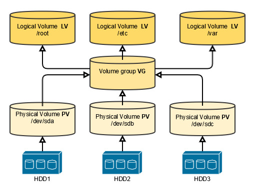

# LVM

<a href="https://www.youtube.com/watch?v=MeltFN-bXrQ">Video Link</a><br/>
<a href="https://www.learnlinux.tv/linux-logical-volume-manager-lvm-deep-dive-tutorial/">Official blog post</a><br/>

Logical Volume Manager (LVM) is a storage management tool in Linux that provides flexibility in managing disk space. It allows you to create, resize, and manage disk volumes dynamically, making it easier to handle storage needs without downtime. 

Key Concepts :
1. Physical Volumes (PVs): These are raw storage devices (e.g., hard disks, SSDs, or partitions). LVM uses them as the basic building blocks.
2. Volume Groups (VGs): These are pools of storage made from one or more PVs. VGs aggregate storage, making it easier to allocate and manage.
3. Logical Volumes (LVs): These are the "virtual" partitions created from the storage in a VG. LVs can be resized or moved dynamically.

Benefits of LVM:
1. Dynamic Resizing: Resize logical volumes without unmounting.
2. Snapshots: Create point-in-time copies of volumes.
3. Better Utilization: Combine multiple disks or partitions into a single storage pool.
4. Easy Management: Manage storage across multiple physical devices as a unified system.

---
Explanation:


As you can see, we can have multiple hard drive or just the one, but the nice thing is we can add additional hard drives
and configure them to be physical volumes and add them to our volume group so or logical volumes can be extended or new
ones can be created.

## Steps to Set Up LVM
Prerequisite: Install LVM tools. On most Linux distributions, this can be done with:

```
sudo apt install lvm2  # For Debian/Ubuntu
sudo yum install lvm2  # For Red Hat/CentOS
```

### Identify Storage Devices
List available storage devices with:
```
lsblk
```

### Create Physical Volumes
Mark the chosen storage devices as physical volumes:
```
sudo pvcreate /dev/sdX /dev/sdY
```
Replace /dev/sdX and /dev/sdY with your actual device names.
here we are choosing 2 physical volumes. If you have just one hard drive or SSD or nvme. just choose that one.

for example in installing arch after we partition our disk and allocate for efi and boot, we create the physical volume
for example on the third partition or our nvme. So in this example:
```
sudo pvcreate /dev/nvme0n1p3
```
If you are using `luks`, first decrypt the partition and use the name of the decrypted partition for creating your
physical volume.

### Create a Volume Group
Combine the physical volumes into a volume group:
```
sudo vgcreate my_vg /dev/sdX /dev/sdY
```
`my_vg` is the name of your volume group.

### Create Logical Volumes
Allocate space from the volume group to create logical volumes:
```
sudo lvcreate -L 10G -n my_lv my_vg
```

    -L 10G: Specifies the size of the logical volume.
    -n my_lv: Names the logical volume.
    my_vg: Specifies the volume group.

### Format and Mount the Logical Volume
Format the logical volume with a file system:
```
sudo mkfs.ext4 /dev/my_vg/my_lv
```

### Create a mount point and mount the volume:
```
sudo mkdir /mnt/my_mount_point
sudo mount /dev/my_vg/my_lv /mnt/my_mount_point
```

### Persistent Mounting
To make the mount permanent, add an entry in `/etc/fstab`:
```
/dev/my_vg/my_lv  /mnt/my_mount_point  ext4  defaults  0  2
```

## Common LVM Commands

### List physical volumes:
```
sudo pvs
```
or
```
pvdisplay
```

### List volume groups:
```
sudo vgs
```
or
```
vgdisplay
```

### List logical volumes:
```
sudo lvs
```
or
```
lvdisplay
```

### Extend a logical volume:
```
sudo lvextend -L +5G /dev/my_vg/my_lv
sudo resize2fs /dev/my_vg/my_lv  # For ext4 file system
```

### Remove a logical volume:
```
sudo lvremove /dev/my_vg/my_lv
```


## Adding another Hard drive
Lets say we add an additional hard drive or nvme. First we get the info we `lsblk` and then create a physical volume and
`extend` the volume group, basically adding our physical volume aka new hard drive to `vg`. Example:
```
pvcreate /dev/sdb
```
Now add the newly created physical volume to our volume group, assuming its name is `vg_ubuntu`:
```
vgextend vg_ubuntu /dev/sdb
```

Now we can use the new extra space to create new logical volumes or better than that **Extend a logical volume**
```
lvextend -L +10G /dev/mapper/vg_ubuntu-lv_root
```
but this doesnt do the trick, you have to resize the filesystem too:
```
resize2fs /dev/mapper/vg_ubuntu-lv_root
```

you can check things with
```
df -h
```

or we can do the extending and resizing in one go:
```
lvextend --resizefs -l +100%FREE /dev/mapper/vg_ubuntu-lv_root
```
here we gave the logical volume all the remaining space and resize the filesystem in one command.

## Example with fstab
Assuming we added the new hard drive, use **lsblk** to get the name and create a `pv`:
```
pvcreate /dev/sdc
```

Create the volume group. We are creating a new volume group:
```
vgcreate vg_extra /dev/sdc
```

Check the volume group
```
vgdisplay
```

Create a logical volume (named lv_logs in this example)
```
lvcreate vg_extra -L 5G -n lv_logs
```

Format the logical volume
```
mkfs.ext4 /dev/mapper/vg_extra-lv_logs
```

Create a directory to mount the new logical volume
```
mkdir -p /mnt/extra/logs
```

Mount the logical volume
```
mount /dev/mapper/vg_extra-lv_logs /mnt/extra/logs
```

Find the “block id” with blkid command.Need root privilages:
```
blkid /dev/mapper/vg_extra-lv_logs
```

Back up your fstab file to be safe
```
cp /etc/fstab /etc/fstab.bak
```

Edit the fstab file
```
nvim /etc/fstab
```

Add a line to the fstab to mount the volume, similar to this
```
UUID=<BLOCK ID FOR LOGICAL VOLUME> /mnt/extra/logs ext4 defaults 0 2
```
for example like this `UUID=c28b522b-c20b-4f7c-9ec3-72160949d52c`<br/>
replace your UUID for the volume.


Test the new mount, first making sure it’s not mounted
```
umount /mnt/extra/logs
```

Then test your fstab file (BEFORE rebooting)
```
mount -a
```

If no errors, then you’re all set.


## Snapshots
### create a snapshot
As we used the `lvcreate` for creating the logical volumes ,we also use this command to create snapshots.<br/>
Example:
```
lvcreate /dev/mapper/<SOURCE VOLUMEGROUP NAME> -L 1G -s -n snapshot_name
```
for Example:
```
lvcreate /dev/mapper/vg_extra-lv_web -L 1G -s -n web_snapshot_2024
```
The `-s` means snapshot and `-n` is for name. Choose a name.

Now run the `lvs` command:
```
lvs
```
and you see the original volumes and the snapshot we just created.<br/>
The way we can see that a volume is a snapshot is that an `origin` part is pointing to the volume that we took a
snapshot from.

### Mount a snapshot
```
mount /dev/mapper/vg_extra-web_snapshot_20200421 /mnt/extra/snapshot
```
We can mount the snapshot this way and  recover our files. But there is another way. But before trying it, unmount this
snapshot.

### Restore the snapshot:
```
lvconvert --merge /dev/mapper/snapshot_name
```
And this works because the origin is pointing to the logical volume

### Deactivate/reactivate to fresh it:
```
lvchange -an /dev/mapper/vg_extra-lv_web
lvchange -ay /dev/mapper/vg_extra-lv_web
```
