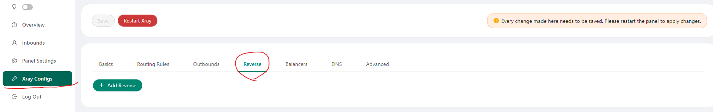
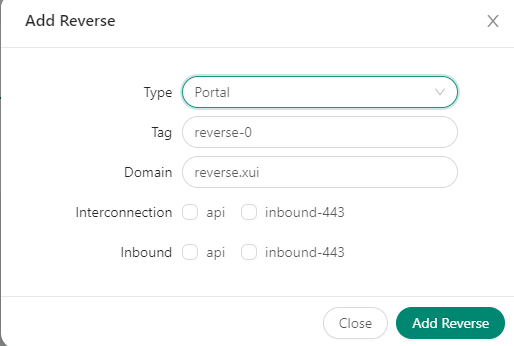
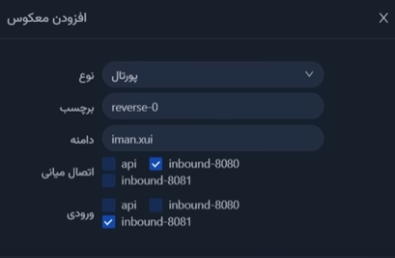
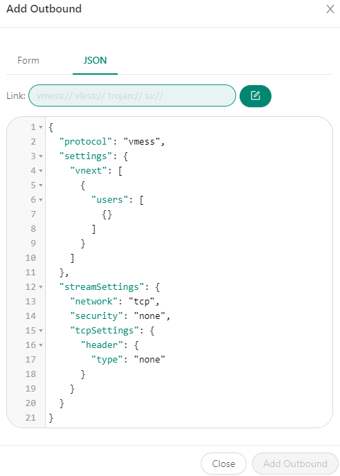
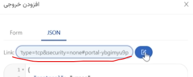
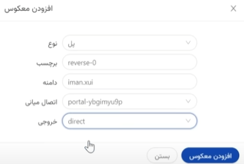

# X-UI Reverse Tunnel:

On the first server for example IRAN server we install **x-ui**.
We need to create 2 inbounds for example:

    portal vless-tcp-8080
    user vless-tcp-8081
**portal** inbound is used for connection between 2 servers and **user** is for us.

Go to Xray configs > Reverse:

Click on Add reverse.

Make sure the **type** is set to **Portal** and NOT ~~Bridge~~
Also make sure that **Tag** is the same on both servers.
**Domain** is a fake domain for connection between 2 servers.

Example:

Make a copy of **portal** config on first server aka Iran server.
We need this config to be pasted in the second server aka EU server in the outbound section.

Now on the second server aka EU server:
Xray configs > **Outbounds** > **Add outbound** 
select the **JSON** to paste the config

Now add a **reverse** with the **Bridge** type.
Make sure domains on both servers are the same.
And **interconnection** is what we added in the outbounds section.
And make outbound **direct**.
**Restart xray**.

Now we can use the config with name of user on first server aka IRAN to 
use in v2rayn.
